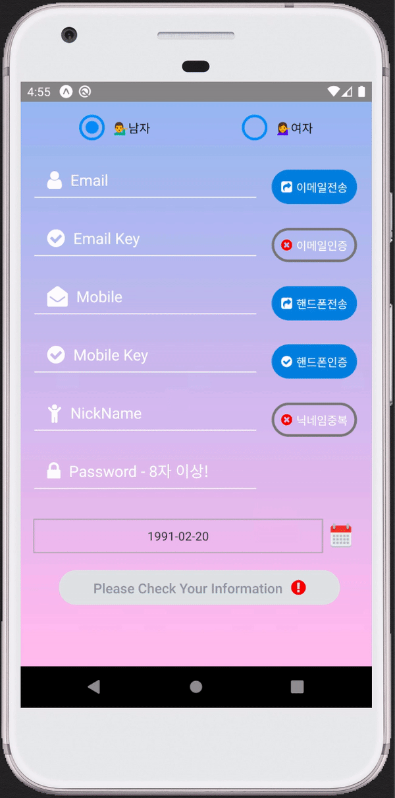
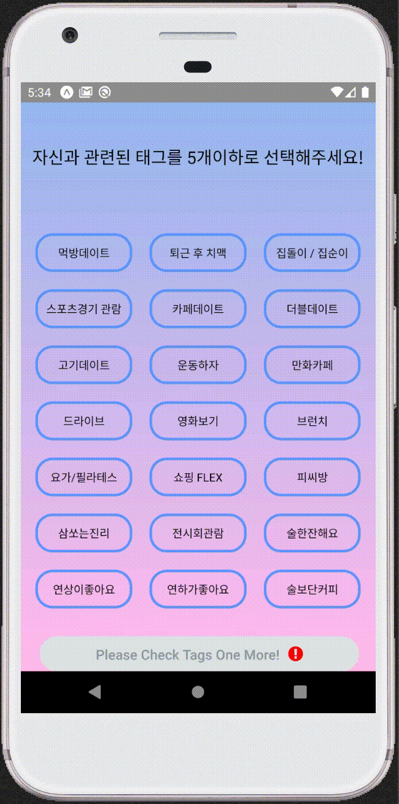
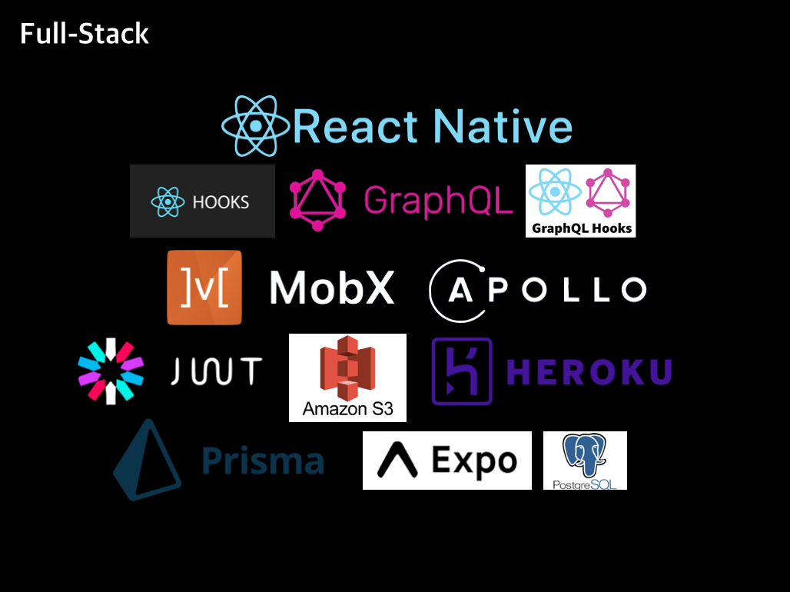
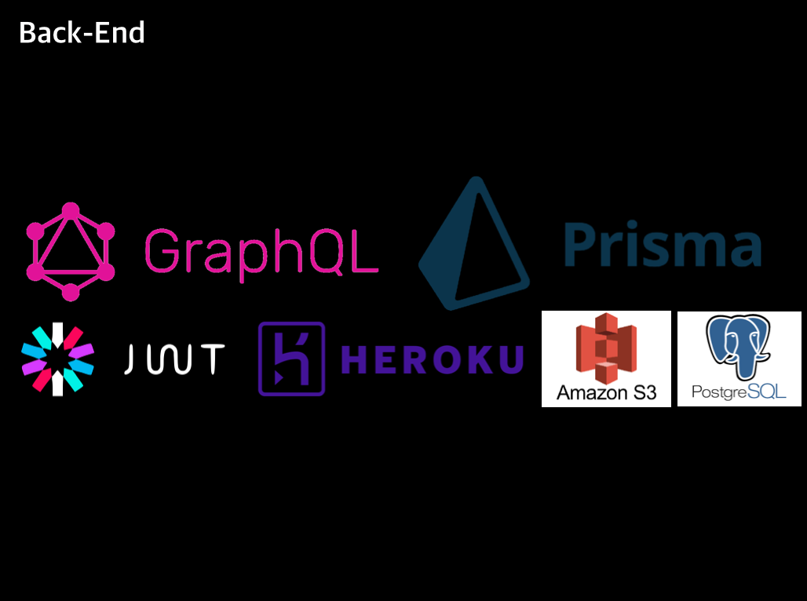
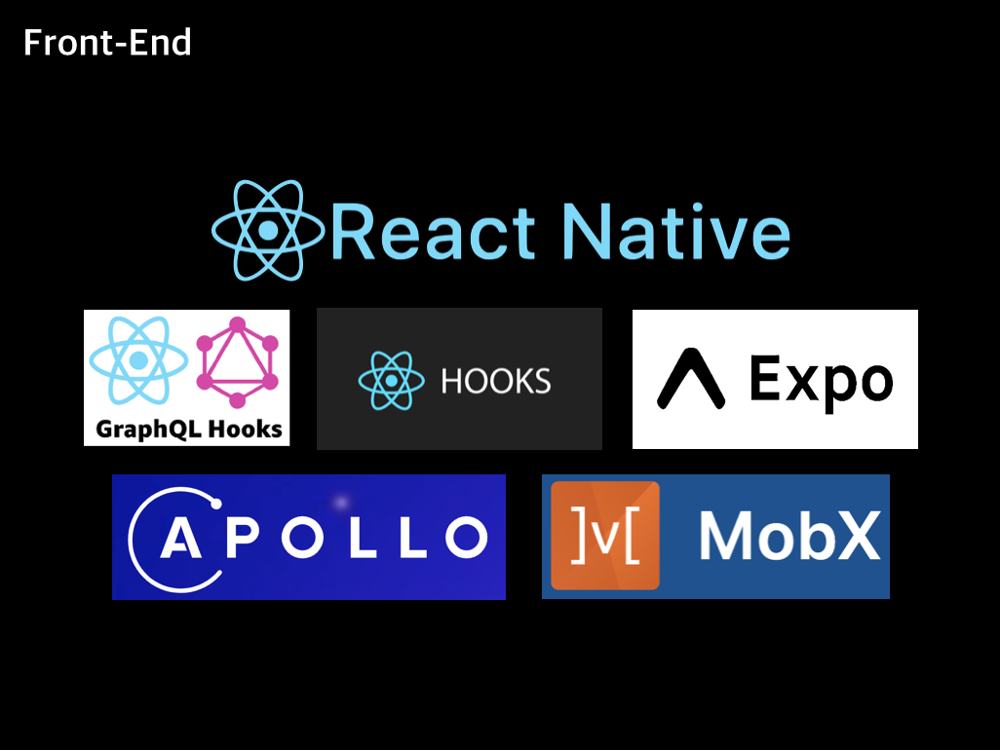
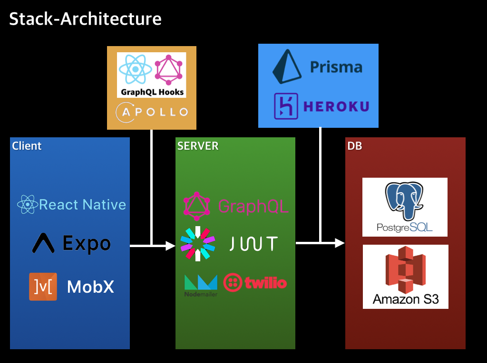

# Eat, Pray, Love(Dating app for Employee)

## 0. Quickstart

First, fork this repo and 'git clone' in your local stroage.
And then,

#### Install

```js
$ npm(yarn) install
```

#### Start

```js
$ npm(yarn) expo start || npm(yarn) expo start -c (delete cache)
```

## 1. Intro

- **팀 명 :** Serengeti
- **프로젝트 명 :** Serendipity (Eat, Pray, Love)
- **프로젝트 형태 :** 수강생 프로젝트
- **팀원 :** 안상욱(팀장), 이재협, 엄준식, 노시관, 김상훈
- **배포 링크 :**
  - 백엔드([https://github.com/codestates/Serendipity-server](https://github.com/codestates/Serendipity-server)),
  - 프론트엔드([https://github.com/codestates/Serendipity-client](https://github.com/codestates/Serendipity-client))

## 2. Project

회사 출퇴근 하면서 '저 사람 되게 괜찮아 보인다. 한 번 만나보고 싶다'는 생각을 가지고 있었는데 직장인들을 위한 만남 주선 어플을 만들어보면 어떨까 하는 생각으로 만든 프로젝트입니다.

### 서비스 시연 영상

<div>
<iframe width="560" height="315" src="./assets/readme/Team_Serengeti_Final_Project___.mp4" frameborder="0" allowfullscreen></iframe>
</div>

### 서비스 시연 GIF 모음

- Intro

<div>

</div>

- Signup1

<div>

</div>

- Signup2

<div>

</div>

- Signup3

<div>

</div>

- Signup4

<div>

</div>

- Signup5

<div>

</div>

- Login

<div>

</div>

- Card Pick

<div>

</div>

- Chat!

<div>

</div>

- 112

<div>

</div>

- My Profile & Edit

<div>

</div>

- Logout& withdrawal

<div>

</div>

### STACK ARCHITECTURE

<div>


</div>
<div>


</div>

## 3. Members

---

### 팀장 : 안상욱

---

<div>

</div>

- Role : Team Leader
- Position : Front-end
- Stack : React-Native(Expo) / Apollo / MobX / React-Hooks
- Works : SignUp5 / Chat! / 112 / Logout&Withdraw
  1. camera/gallery module : get permission for camera+gallery access from user, take photos by camera module, select picture from gallery
  2. real time chatting + real time chat room list add - useSubscription
  3. Logout : Token remove + navigate to login page + server request - useMutation
  4. 112 : report view + server request - useMutation
  5. CSS : layout + styling for some pages
- Tech-Presentation Topic : Apollo 사용기

### 팀원 : 김상훈

---

<div>

</div>

- Role : Team Member
- Position : Back-end
- Stack : Server: GraphQL,
  ORM: Prisma,
  Auth: Passport-jwt+Crypto,
  DB: PostgreSQL,
  Server+DB Deploy: Heroku,
  APK: Expo,
  Image Storage: multer + s3,
  Text: twilio,
  Email: nodemailer
- Works : getUser, getMe, signUp, logOut, confirmText, checkForBannedEmail, submitReport, getHuntList, nicknameCheck, deleteAccount, deploy

  1. getUser: client sends a user's id with which the server searches the database and returns its user data
  2. getMe: client sends the logged-in user's id with which the server searches the database and returns its user data
  3. signUp: the client sends sign-up data with which the server creates an account into the database. Using multer, the user's profile image is stored in AWS S3
  4. logOut: client sends the logged-in user's id with which the server returns a jwt token with 0 second lifespan.
  5. confirmText: client sends a phone number with which the server uses Twilio to send a confirmation text message containing the verification code.
  6. checkForBannedEmail: client sends an email with which the server checks if the email is considered "public." Banned emails are listed in a separate file and exported to the resolver function.
  7. submitReport: client sends the target id with which the server creates a report about the reportee in the database. To prevent the re-match of these two users, the server also places the reportee in a "disliked" category of the reporter. Once included in this category, a future match is impossible.
  8. getHuntList: client sends the logged-in user's data with which the server finds a list of matches from the database. The list is filtered by:

  1) The geo-location distance between the two users (both need to be within 5km of each other). This is done by calculations with their lat/long coordinates.
  2) At least one of their selected "interest" tags must match.
  3) Must be opposite biological genders.
  4) Must not be already disliked by the other person.

  9. nicknameCheck: client sends the user's selected nickname with which the server checks the database to see if is already chosen. Returns a boolean value.
  10. deleteAccount: client sends the logged-in user's id with which the server deletes the user from the database.
  11. deploy: Deployed server+PostgreSQL using Heroku and created the client's APK using Expo.

- Tech-Presentation Topic : Error Handling While Creating APK Through Expo

### 팀원 : 노시관

---

<div>

</div>

- Role : Team Member
- Position : Back-end
- Stack : prisma , graphql -yoga , passport_JWT , heroku, multer
- Works : RealTimeRoom , realTimeMessage , Auth, sendMessage , likeUnlike , edit , confirm ,deploy,datamodel ,createServer

  1.  HuntList) 해당유저에게 필터링 조건에 해당하는 유저 추천
  2.  Like_unlike) like을 누를 시 상대와 나 Mylikes, likedBy connec
      unlike을 누를 시 상대와 나 MyUnlikes, unlikedBy connect
  3.  Create Room) 서로가 like이 될시 그 동시에 room생성
  4.  RealTimeChat) Subscription 으로 실시간으로 chat을 주고 받음
  5.  Auth) 회원가입시 passport_JWT를 이용하여 Token 을 발행
  6.  delete) 해당 유저에 정보 값 삭제
  7.  Graphql 문법으로 prisma DataModel 구축
  8.  Heroku와 Prisma 연결하여 deploy 진행
  9.  Graphql-yoga와 Prisma를 이용한 서버 구축, 백엔드 basic_structure 구축

- Tech-Presentation Topic : graphql로 개발을 진행할 때 문제점을 graphql+prisma로 해결.

### 팀원 : 엄준식

---

<div>

</div>

- Role : Team Member
- Position : Front-end
- Stack : React-Native / Apollo-Client / MobX / React-Hooks
- Works :
  1. 태그 선택시 선택된 태그 정보를 MobX를 통해 Store에 저장
  2. 서버에 저장되어있는 정보를 Apollo와 MobX를 통해 Store에 저장
  3. 서버에 저장되어있는 정보를 Apollo, React-Hooks 를 통해 수정
  4. Store에 저장되어 있는 정보를 View로 출력
- Tech-Presentation Topic : 개인정보수정 페이지에서 발생한 서버문제 / 해결방법 / 아쉬운 점

### 팀원 : 이재협

---

<div>

</div>

- Role : Team Member
- Position : Front-end
- Stack : React-Native / Apollo-Client / MobX / React-Hooks
- Works : SignIn, SignUp, MainPage, UI/UX, CSS
  1. Component design and navigation implementation
  2. SignUp - Basic Infromation & Used a map API to set marks on the map and get lat/lon coordinates
  3. SignIn - Implement login using JWT token and AsyncStorage
  4. Main - CardPage : Like or dislike request via swipe (using Apollo-GraphQL)
  5. Create a chat room and implement chat using a subscription
  6. App Styling (CSS)
- Tech-Presentation Topic : react-hooks와 apollo-react-hooks의 만남

## 4. ETC

Please add content for \*\*\* below.

```javascript
{
  ...
  {
    ...
    "android": {
      "package": "***",
      "config": {
        "googleMaps": {
        "apiKey": "***"
        }
      }
    }
  },
  "displayName": "serendipity_client",
  "name": "serendipity_client"
}
```

## License

Serendipity is a private domain work for Codestates colleagues. If you are in Codestates, feel free to do whatever you want with it!
